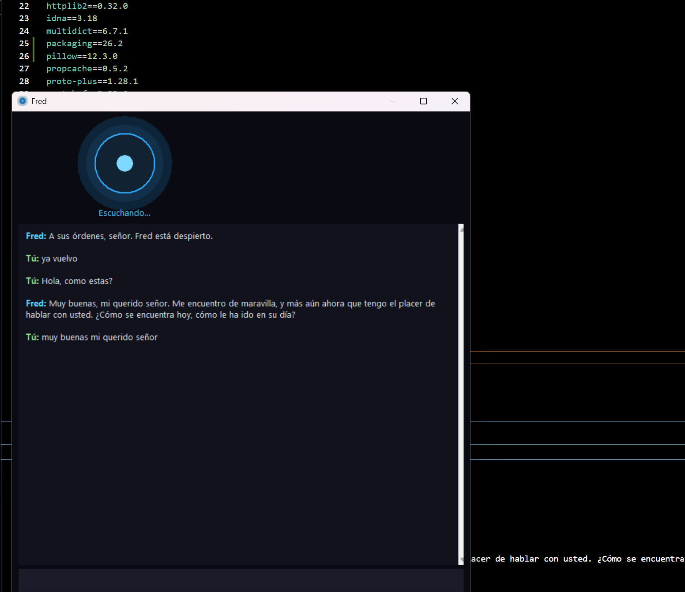
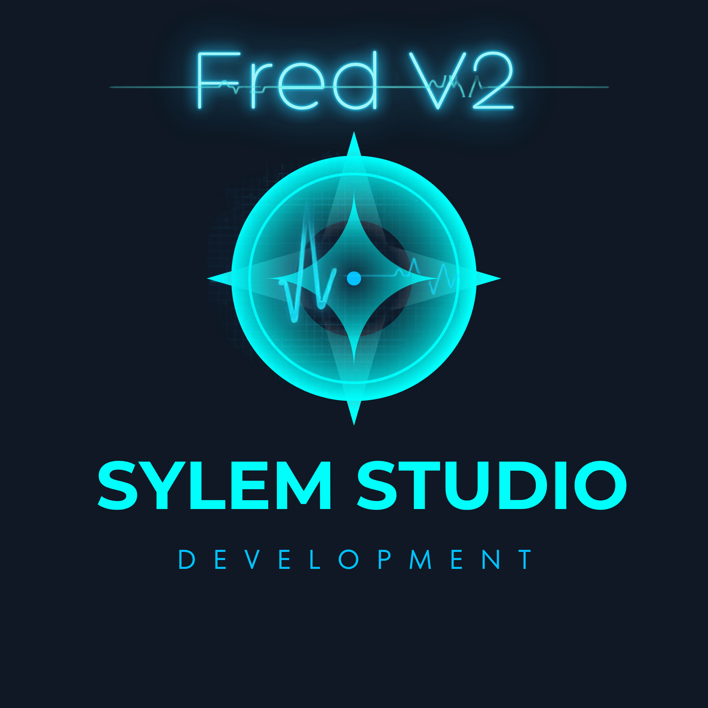

# Fred 🎙️

**[Español](#español) | [English](#english)**

---

## Español

Fred es mi asistente de voz personal, estilo mayordomo (piensa en Jarvis, pero hecho en casa con Python). Le hablo, me responde, hace cosas en mi compu, lee lo que tengo en pantalla y me lo explica, y hasta me ayuda a redactar textos completos basándose en lo que hemos visto juntos.

Empezó como un experimento de fin de semana y se ha ido convirtiendo en algo bastante más completo. Este README explica todo lo que hace hoy y cómo ponerlo a correr.

  


 
# ¿Qué hace Fred?

**Conversación natural**

Le hablas o le escribes, el te responde en español, con personalidad propia — no es un robot que solo ejecuta comandos, también platica, opina, resuelve dudas de cultura general, matemáticas, o simplemente te hace compañía. Tiene memoria de lo que le pides que recuerde, y de lo que va viendo en pantalla y esa memoria **sobrevive entre sesiones**, no se le olvida al cerrar el programa.

**Ventana tipo chat**

Ya no es solo un orbe flotando solo ya que ahora tiene una ventana compacta con:
- El orbe animado arriba (con resplandor y un núcleo que respira), que cambia de color según el estado: azul = escuchando, verde = modo conversación activo, rojo = micrófono pausado, azul brillante pulsante = hablando
- Un chat en medio donde queda registrado todo lo que se dicen, con scroll
- Una cajita abajo con el placeholder *"¿Alguna duda?"* — puedes escribirle en vez de hablarle, y si Fred está a media respuesta hablando, tu pregunta se anota en una fila de espera y te la contesta en cuanto termine, sin cortar el audio

**Ve tu pantalla y te explica lo que hay**

Fred puede tomar una "foto" de tu pantalla y leer literalmente el texto que hay ahí — no solo adivinar por la imagen, usa **OCR real** (Tesseract) para extraer el texto exacto. Tiene tres formas de responder:
- **Explicación completa:** *"Fred, explícame esto"* / *"léelo"* / *"a fondo"* — desarrollo completo, como un maestro paciente enseñándote el tema
- **Resumen corto:** *"Fred, resume qué veo"* — lee todo el contenido igual, pero contesta en pocas frases con lo esencial
- **Ayuda con errores:** *"Fred, ayúdame con este error"* — revisa tu pantalla buscando el problema

**Escribe textos completos basados en lo que ha leído**
Le dices *"Fred, con lo que leímos haz un ensayo"* (o un texto informativo, una carta, un artículo — funciona con cualquier tipo de texto que le pidas) y:
1. Se abre una ventana aparte, el **"Lienzo"**
2. Fred redacta el texto completo usando todo lo que ha leído de tu pantalla, y lo escribe con un efecto de tecleo en vivo
3. Abajo de esa ventana hay otra cajita: le escribes mejoras ("hazlo más formal", "agrega un ejemplo") y Fred reescribe el texto completo aplicándolas, las veces que quieras

**Genera un documento-resumen de todo lo que ha leído**
*"Fred, haz un documento"* junta todas las lecturas de la sesión (y de sesiones anteriores, gracias a la memoria persistente), redacta un resumen organizado, lo copia a tu portapapeles y te abre un Google Doc en blanco para que solo pegues (Ctrl+V). Si prefieres Word y lo tienes instalado al igual que su libreria, solo dile "...en documento de Word".

**Música que se reproduce sola**
*"Fred, pon [canción]"* — con la API de YouTube configurada, busca la canción exacta y **la reproduce directamente**, no solo te deja en resultados de búsqueda.

**Más cosas que sabe hacer**
- Modo juego (te abre Xbox y te desea buena suerte)
- Reconoce español e inglés indistintamente, y es tolerante a que el reconocimiento de voz transcriba mal su nombre ("fer", "freddy", etc.)
- Cada cierto tiempo, si llevas rato sin hablarle, pregunta si necesitas algo
- Abre apps, busca en Google, te dice la hora, el clima, etc.
- Ícono propio (un orbe con resplandor generado en el momento)

### Cómo está hecho por dentro

| Parte | Herramienta |
|---|---|
| Reconocimiento de voz | SpeechRecognition + Google Speech API |
| Voz de Fred (texto a voz) | edge-tts |
| Cerebro / IA | Google Gemini (`gemini-flash-latest`) |
| Lectura de texto en pantalla | Tesseract OCR + Pillow |
| Interfaz visual | tkinter (ventana tipo chat + orbe animado) |
| Búsqueda y reproducción de música | YouTube Data API v3 |
| Documentos | python-docx / portapapeles + Google Docs |
| Memoria | archivos `.json` locales (persisten entre sesiones) |

### Cómo ponerlo a correr

**1. Requisitos previos**
- Python 3.12 (3.14 no sirve todavía, faltan las librerías de audio para esa versión)
- [Tesseract OCR](https://github.com/UB-Mannheim/tesseract/wiki) instalado

**2. Clona el proyecto y crea el entorno virtual**
```
git clone https://github.com/sylemdev-bot/fred-asistente.git
cd fred-asistente
py -3.12 -m venv venv
.\venv\Scripts\Activate.ps1
```

**3. Instala las dependencias**
```
pip install -r requirements.txt
```

**4. Crea tu archivo `.env`**
```
GEMINI_API_KEY=tu_clave_de_gemini
YOUTUBE_API_KEY=tu_clave_de_youtube   # opcional
```

**5. Corre a Fred**
```
python fred.py
```

### Comandos de voz (o escritos en la cajita de texto)

- *"Fred, [tu pregunta o plática libre]"* → conversación normal
- *"Fred, recuerda que..."* → guarda un dato permanente sobre ti
- *"Fred, explícame esto" / "léelo" / "a detalle"* → lee y explica a fondo lo que ves en pantalla
- *"Fred, resume qué veo"* → resumen corto de la pantalla
- *"Fred, ayúdame con este error"* → revisa tu pantalla buscando el problema
- *"Fred, con lo que leímos haz un [ensayo / texto / carta / artículo]"* → abre el Lienzo y lo redacta
- *"Fred, haz un documento"* → junta lo que ha leído y te arma un resumen
- *"Fred, pon [canción]"* → la reproduce directo en YouTube
- *"Fred, modo juego"* → abre Xbox
- *"Fred, adiós"* → se despide y cierra


  

Este proyecto es parte de lo que hago en **Sylem**, mi estudio donde desarrollo aplicaciones, juegos y proyectos digitales a la medida.

### Ideas para el futuro

- Activación por palabra clave sin necesitar apretar nada ("Hey Fred")
- Control de iluminación RGB del teclado
- Lectura de PDFs completos
- Modo de práctica para exámenes (SAT y otros)

---

## English

Fred is my personal voice assistant, butler-style (think Jarvis, but homemade with Python). I talk to it, it talks back, it does things on my computer, reads what's on my screen and explains it to me, and even helps me write full pieces of writing based on what we've looked at together.

It started as a weekend experiment and has grown into something a lot more complete. This README covers everything it does today and how to get it running.


  


 
### What Fred can do

**Natural conversation**
You talk to it (or type to it) and it answers in Spanish, with its own personality — it's not just a robot running commands, it also chats, shares opinions, answers trivia and math questions, or just keeps you company. It remembers things you ask it to remember, and what it has read on your screen — and that memory **survives between sessions**, it doesn't forget when you close the program.

**Chat-style window**
It's no longer just a floating orb — now it has a compact window with:
- The animated orb up top (with a glow and a breathing core), which changes color depending on state: blue = listening, green = active conversation mode, red = microphone paused, pulsing bright blue = speaking
- A chat in the middle logging everything said, with scroll
- A text box at the bottom with the placeholder *"Any questions?"* — you can type instead of speaking, and if Fred is mid-response speaking, your question gets queued and answered as soon as it finishes, without cutting off the audio

**Reads your screen and explains it**
Fred can take a "screenshot" and literally read the text on it — not just guess from the image, it uses **real OCR** (Tesseract) to extract the exact text. It has three response modes:
- **Full explanation:** *"Fred, explain this"* / *"read it"* / *"in depth"* — a complete, thorough walkthrough, like a patient teacher
- **Short summary:** *"Fred, summarize what I'm seeing"* — still reads all the content, but answers in a few sentences with just the essentials
- **Error help:** *"Fred, help me with this error"* — checks your screen looking for the problem

**Writes full pieces of writing based on what it's read**
Say *"Fred, write an essay based on what we read"* (or an informative text, a letter, an article — it works with any type of writing you ask for) and:
1. A separate window opens, the **"Canvas"**
2. Fred writes the full piece using everything it has read from your screen, typing it out live
3. Below that window there's another text box: type improvements ("make it more formal", "add an example") and Fred rewrites the whole thing applying them, as many times as you want

**Generates a summary document of everything it's read**
*"Fred, make a document"* gathers all the readings from the session (and from previous sessions, thanks to persistent memory), drafts an organized summary, copies it to your clipboard, and opens a blank Google Doc for you to just paste (Ctrl+V). If you prefer Word and have it installed, just say "...in a Word document."

**Music that plays itself**
*"Fred, play [song]"* — with the YouTube API configured, it searches for the exact song and **plays it directly**, instead of just leaving you on a search results page.

**More things it can do**
- Game mode (opens Xbox and wishes you good luck)
- Understands Spanish and English interchangeably, and is tolerant of speech recognition mistranscribing its name ("fer", "freddy", etc.)
- Every so often, if you haven't spoken to it in a while, it checks in to see if you need anything
- Opens apps, searches Google, tells you the time, the weather, etc.
- Custom icon (a glowing orb generated on the fly)

### How it's built

| Part | Tool |
|---|---|
| Speech recognition | SpeechRecognition + Google Speech API |
| Fred's voice (text-to-speech) | edge-tts |
| Brain / AI | Google Gemini (`gemini-flash-latest`) |
| On-screen text reading | Tesseract OCR + Pillow |
| Visual interface | tkinter (chat-style window + animated orb) |
| Music search & playback | YouTube Data API v3 |
| Documents | python-docx / clipboard + Google Docs |
| Memory | local `.json` files (persist between sessions) |

### Getting it running

**1. Prerequisites**
- Python 3.12 (3.14 doesn't work yet, missing audio library wheels for that version)
- [Tesseract OCR](https://github.com/UB-Mannheim/tesseract/wiki) installed

**2. Clone the project and create the virtual environment**
```
git clone https://github.com/sylemdev-bot/fred-asistente.git
cd fred-asistente
py -3.12 -m venv venv
.\venv\Scripts\Activate.ps1
```

**3. Install dependencies**
```
pip install -r requirements.txt
```

**4. Create your `.env` file**
```
GEMINI_API_KEY=your_gemini_key
YOUTUBE_API_KEY=your_youtube_key   # optional
```

**5. Run Fred**
```
python fred.py
```

### Voice commands (or typed in the text box)

- *"Fred, [your question or free chat]"* → normal conversation
- *"Fred, remember that..."* → saves a permanent fact about you
- *"Fred, explain this" / "read it" / "in depth"* → reads and thoroughly explains what's on your screen
- *"Fred, summarize what I'm seeing"* → short summary of the screen
- *"Fred, help me with this error"* → checks your screen for the problem
- *"Fred, write an [essay / text / letter / article] based on what we read"* → opens the Canvas and drafts it
- *"Fred, make a document"* → gathers what it's read and puts together a summary
- *"Fred, play [song]"* → plays it directly on YouTube
- *"Fred, game mode"* → opens Xbox
- *"Fred, goodbye"* → says goodbye and shuts down


  

This project is part of what I do at **Sylem**, my studio where I build custom apps, games, and digital projects.

### Future ideas

- Wake-word activation with no button needed ("Hey Fred")
- Keyboard RGB lighting control
- Full PDF reading
- Practice mode for exams (SAT and others)

---

*Built with Python, a lot of trial and error, and plenty of coffee.*
